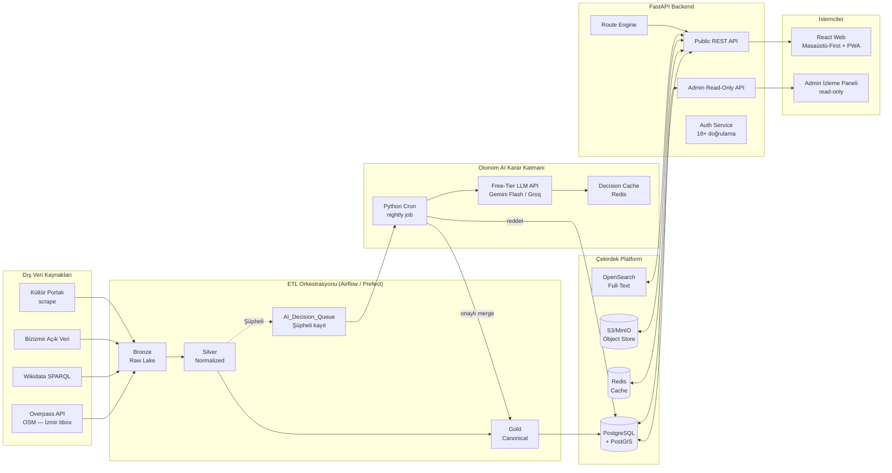
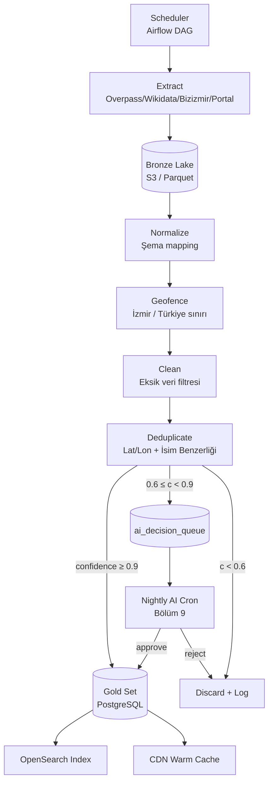
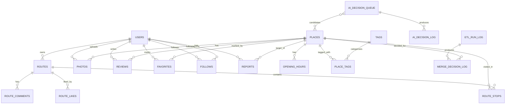
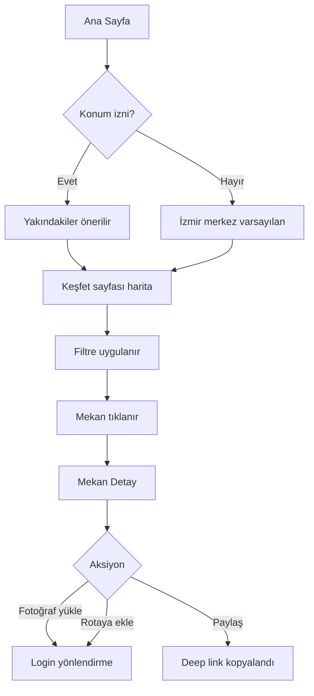
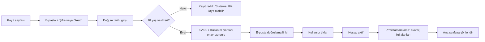
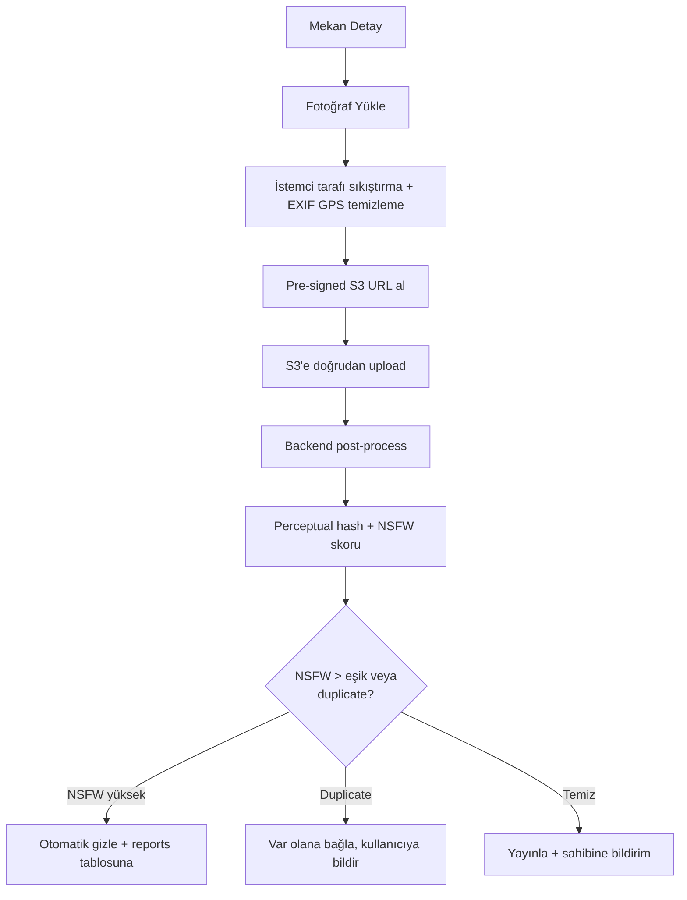
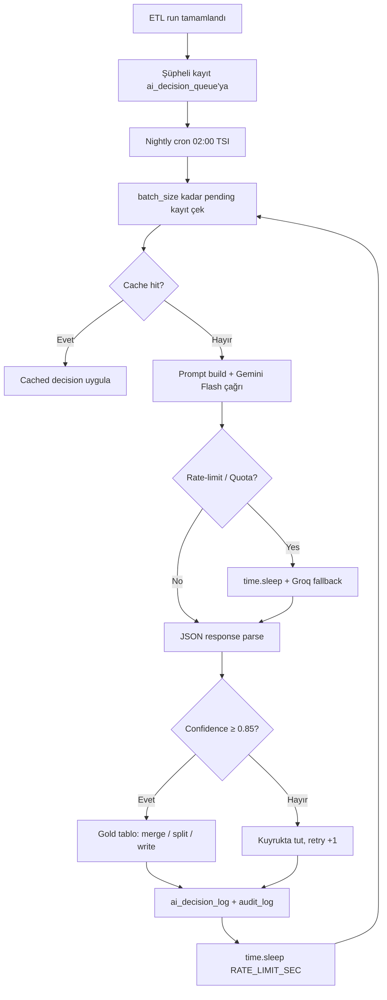
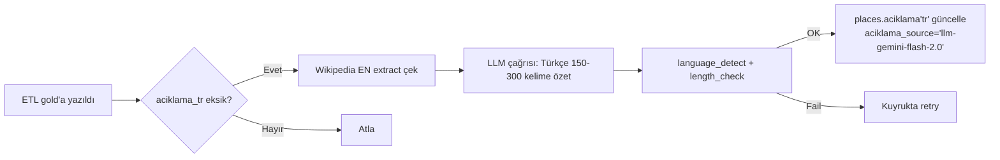
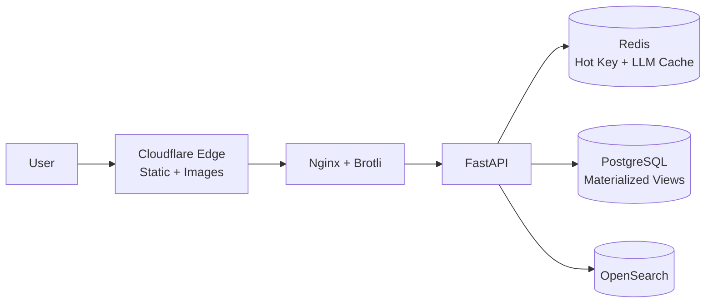

# PRD — **KültürRota**
### Türkiye Kültürel Miras Keşif ve Sosyal Gezi Platformu

| Alan | Değer |
|---|---|
| **Doküman Sürümü** | v2.0 (Mentor Sunum — Sadeleştirilmiş) |
| **Doküman Sahibi** | Ürün & Mimari Ekibi |
| **Hazırlayan Rolü** | Senior Software Architect & Product Manager |
| **Durum** | Onay Bekliyor |
| **Hedef Sunum Tarihi** | T+2 gün (Mentor Sunumu) |
| **Hedef Lansman (MVP)** | T+12 hafta |
| **Pilot Şehir (MVP)** | **İzmir** |

> **Önerilen Ürün İsmi:** **KültürRota** (alternatifler: *MirasMap*, *AnatoliaTrails*).

---

## İçindekiler

1. [Yönetici Özeti](#1-yönetici-özeti)
2. [Alınan Ürün Kararları (Locked Decisions)](#2-alınan-ürün-kararları-locked-decisions)
3. [Ürün Vizyonu, Misyonu ve Stratejik Hedefler](#3-ürün-vizyonu-misyonu-ve-stratejik-hedefler)
4. [Problem Tanımı ve Pazar Fırsatı](#4-problem-tanımı-ve-pazar-fırsatı)
5. [Hedef Kitle ve Personalar](#5-hedef-kitle-ve-personalar)
6. [Ürün Kapsamı (MVP & Roadmap)](#6-ürün-kapsamı-mvp--roadmap)
7. [Sistem Mimarisi (High-Level)](#7-sistem-mimarisi-high-level)
8. [Veri Kaynakları ve ETL Pipeline (Bronze → Silver → Gold)](#8-veri-kaynakları-ve-etl-pipeline-bronze--silver--gold)
9. [Otonom AI Karar Katmanı (Free-Tier LLM)](#9-otonom-ai-karar-katmanı-free-tier-llm)
10. [Veritabanı Tasarımı ve "Gold Set" Şeması](#10-veritabanı-tasarımı-ve-gold-set-şeması)
11. [Database Tabloları Arası İlişkiler (ERD)](#11-database-tabloları-arası-ilişkiler-erd)
12. [API Tasarımı](#12-api-tasarımı)
13. [Site Yapısı (Sayfalar)](#13-site-yapısı-sayfalar)
14. [Kullanıcı Akışları (User Flows)](#14-kullanıcı-akışları-user-flows)
15. [Yenilikçi Özellikler ve Diferansiyasyon](#15-yenilikçi-özellikler-ve-diferansiyasyon)
16. [Teknoloji Yığını](#16-teknoloji-yığını)
17. [Güvenlik, Yetkilendirme ve KVKK Uyumu](#17-güvenlik-yetkilendirme-ve-kvkk-uyumu)
18. [Performans, Caching ve Ölçeklenebilirlik](#18-performans-caching-ve-ölçeklenebilirlik)
19. [Gözlemlenebilirlik (Observability) ve SRE](#19-gözlemlenebilirlik-observability-ve-sre)
20. [Lisans ve Hukuki Uyumluluk (Atıf Politikası)](#20-lisans-ve-hukuki-uyumluluk-atıf-politikası)
21. [Yol Haritası (Roadmap)](#21-yol-haritası-roadmap)
22. [Riskler ve Azaltma Stratejileri](#22-riskler-ve-azaltma-stratejileri)
23. [Başarı Metrikleri (KPI / OKR)](#23-başarı-metrikleri-kpi--okr)
24. [Sözlük](#24-sözlük)

---

## 1. Yönetici Özeti

**KültürRota**, Türkiye'nin coğrafyasına dağılmış **müze, ören yeri, tarihi yapı, anıt, kale, antik kent ve tescilli kültürel varlıkları** tek bir veri katmanında toplayan; üstüne **fotoğraf paylaşımı, yorum, oylama ve kullanıcıların kendi gezi rotalarını oluşturup paylaşabildiği** sosyal bir keşif platformudur.

Platformun kalbinde, halka açık ve lisansları net olarak tanımlı veri kaynaklarından (OpenStreetMap/Overpass, Wikidata, Bizizmir Açık Veri, Kültür Portalı) beslenen **Bronze → Silver → Gold** olarak yapılandırılmış bir **ETL veri hattı** bulunur. Algoritmanın emin olamadığı şüpheli kayıtlar, **manuel insan paneli olmaksızın**, gece çalışan bir Python cron script'iyle **ücretsiz (free-tier) LLM API'sine** gönderilir; LLM kararı doğrultusunda **otonom olarak** Gold tabloya yazılır veya elenir. Bu yaklaşım, sıfır operasyon maliyetiyle ölçeklenebilir veri kalitesi sağlar.

**Temel Diferansiyatörler:**

- **Lisans-Temiz Veri Mutfağı**: Veri kalitesini kanıtlayan açık atıf ve denetlenebilir ETL.
- **Akıllı Rota Motoru**: Çalışma saatleri, mesafe, açık/kapalı durumu ve kullanıcı ilgi alanları üzerinden kısıtlı optimizasyon (TSP + opening-hours).
- **Otonom AI Karar Katmanı**: Free-tier LLM ile sıfır maliyetli, geceleri otomatik veri birleştirme.
- **Masaüstü-First + PWA**: Karmaşık rota oluşturmaya masaüstü, sahada tüketime PWA.

---

## 2. Alınan Ürün Kararları (Locked Decisions)

> Aşağıdaki kararlar mentor onayı ile **dondurulmuştur**. MVP boyunca değiştirilmeyecek; tüm mimari ve UX kararları bu kapsamda alınmıştır.

| # | Konu | Karar | Etki / Uygulama |
|---|---|---|---|
| **D1** | **Pilot Şehir** | **İzmir** (Bizizmir Açık Veri + OSM ile bağlanır) | ETL pipeline ilk DAG'ları sadece İzmir bbox'ında çalışır. Faz-2'de Türkiye geneli açılır. |
| **D2** | **Müzekart Entegrasyonu** | Resmi API yok → DB'de `muzekart_gecerli` **boolean** alan statik tutulur | Geleceğe hazırlık; UI'de "Müzekart geçerli" bayrağı gösterilir, ödeme/doğrulama yok. |
| **D3** | **Yaş Sınırı (KVKK)** | Sadece **18 yaş ve üzeri** kayıt | Kayıt akışında doğum tarihi zorunlu; çocuk veli onay süreçleri **MVP'de yok**. |
| **D4** | **Platform Önceliği** | **Desktop-First**, sahada tüketim için **PWA** | Rota Builder masaüstü için optimize; mobilde "View & Navigate" odaklı PWA. |
| **D5** | **Çeviri & Zenginleştirme** | Profesyonel çeviri yok → **Wikidata verisi LLM batch script** ile Türkçeleştirilir | Gecelik cron + free-tier LLM; `places.aciklama_tr` alanı otomatik doldurulur. |
| **D6** | **Veri Kalitesi Karar Katmanı** | İnsan küratör paneli yok → **Otonom AI** (free-tier LLM + `time.sleep()`) | Şüpheli birleştirme kayıtları geceleri AI tarafından kararlaştırılır. Detay: Bölüm 9. |
| **D7** | **Oyunlaştırma & AR** | **Kapsam dışı**: rozet, check-in, Kültür Pasaportu, AR, AI yorum özeti **MVP'de yok** | Veritabanı şeması bu özelliklerden temizlenmiştir. |

---

## 3. Ürün Vizyonu, Misyonu ve Stratejik Hedefler

### 3.1 Vizyon

Türkiye'nin kültürel mirasının **dijital iz düşümünü** çıkararak, her gezginin **bir araştırmacı**, her ziyaretin **bir hikaye** olduğu, açık veriye dayalı bir keşif platformu olmak.

### 3.2 Misyon

Halka açık ve lisanslı veri kaynaklarını, otonom AI ile zenginleştirilmiş, çok dilli içeriklerle harmanlamak; ziyaretçilere **en güncel ve coğrafi olarak akıllı** bir gezi deneyimi sunmak.

### 3.3 North Star (Kuzey Yıldızı) Metriği

**"Aktif kullanıcı başına aylık tamamlanan rota sayısı"** (Completed Routes / Monthly Active User).

### 3.4 Stratejik Hedefler (12 Ay)

| Hedef | Açıklama | Ölçüt |
|---|---|---|
| Pilot Tamamlama | İzmir genelinde tam veri kapsamı | 1.500+ canonical entity (İzmir) |
| Ülke Genişleme | Türkiye geneline veri açma | 18.000+ canonical entity |
| Veri Kalitesi | Otonom AI birleştirme doğruluğu | F1 ≥ 0.88 |
| Topluluk | Aylık aktif kullanıcı (MAU) | ≥ 100.000 |
| Sosyal İçerik | Kullanıcı fotoğraf yükleme | ≥ 300.000 |
| Operasyonel | Pipeline + AI run uptime | %99.5 SLA |

---

## 4. Problem Tanımı ve Pazar Fırsatı

### 4.1 Problem

- Kültürel varlık bilgisi **fragmente**: Kültür Portalı, müze siteleri, valilik sayfaları, blog yazıları, Google Maps yorumları.
- Çalışma saatleri, Müzekart geçerliliği, giriş ücretleri **standart olmayan** formatlarda dağınık.
- Gezginlerin tematik rotalar kurması manuel, zaman alıcı ve hatalı.
- Mevcut platformlarda **lisansı belirsiz** içerikler telif sorunları yaratıyor.

### 4.2 Fırsat

- Açık veri ekosistemi (OSM, Wikidata, Bizizmir Open Data) olgunlaştı.
- Türkiye, dünyada ziyaretçi alan ilk 5 ülke arasında.
- Mevcut çözümler (Google Maps, TripAdvisor) **kültürel mirasa özelleşmemiş**; tematik rotalama yok.
- KVKK uyumu sayesinde "lisans-temiz" platform kurumsal (B2G/B2B) lisanslama fırsatı yaratır.

### 4.3 Rakip / İkame Analizi (Özet)

| Aktör | Güçlü | Zayıf | Bizim Fırsat |
|---|---|---|---|
| Google Maps | Kullanım kolaylığı, kapsam | Kültür alanına özelleşmemiş, kaynak gösterimi yok | Lisans-temiz veri + tematik rota |
| TripAdvisor | Yorum hacmi | Türkçe içerik zayıf, tescil bilgisi yok | Yerel uzmanlık + Kültür Bakanlığı verisi |
| Müze siteleri | Resmi bilgi | Tek noktadan birleşik deneyim yok | Türkiye genelinde keşif |
| OSM topluluğu | Açık veri | Tüketici UX'i yok | Tüketici odaklı UX |

---

## 5. Hedef Kitle ve Personalar

### 5.1 Birincil Persona — "Araştırmacı Gezgin Asya"

- 28 yaş, mimar, İstanbul.
- Hafta sonu kaçamakları ve 2-3 günlük tematik geziler planlıyor.
- **Acı Noktaları:** Çalışma saatleri her yerde farklı; mesafe/zaman hesabı zor.
- **Beklediği Değer:** Tek tıkla tematik öneri, açık/kapalı doğrulanmış mekanlar, ziyaretçi fotoğraflarıyla gerçekçi beklenti.

### 5.2 İkincil Persona — "Öğretmen-Anne Sevgi"

- 42 yaş, sosyal bilgiler öğretmeni, Ankara.
- Sınıfı için müze gezisi planlıyor; ailece tatil yapıyor.
- **Beklenti:** Eğitim odaklı tematik rotalar, indirim/öğrenci ücretleri, masaüstünde detaylı plan.

### 5.3 Üçüncül Persona — "Yabancı Turist Marco"

- 34 yaş, İtalya, mimarlık tutkunu.
- 10 günlük Türkiye turu planlıyor.
- **Beklenti:** İngilizce arayüz, UNESCO Dünya Mirası filtresi.

> **Not:** İnsan küratör/moderasyon rolleri MVP'de yer almadığından dahili persona dokümanda tutulmamıştır. Operasyonel görevler **Otonom AI Karar Katmanı** (Bölüm 9) ve minimum admin izleme paneli ile yürütülecektir.

---

## 6. Ürün Kapsamı (MVP & Roadmap)

### 6.1 MVP İçeriği (T+12 hafta, **İzmir Pilot**)

**MVP — Olmazsa Olmazlar:**

1. ETL Pipeline (Overpass + Wikidata + Bizizmir Açık Veri + Kültür Portalı) — **bbox: İzmir**.
2. **Otonom AI Karar Katmanı** (free-tier LLM cron script, `time.sleep()` ile rate limit yönetimi).
3. Kullanıcı kayıt/girişi (18+ doğrulama, e-posta + OAuth: Google/Apple).
4. Harita tabanlı keşif (Mapbox/Leaflet) ve filtreler.
5. Mekan detay sayfası (galeri, açıklama, çalışma saatleri, atıf bloğu, `muzekart_gecerli` bayrağı).
6. Yorum + 1-5 yıldız puan (AI tabanlı toksisite filtresi).
7. Fotoğraf yükleme (otomatik NSFW + EXIF temizleme).
8. **Rota Oluşturucu (manuel + algoritmik öneri)** ve paylaşım — **masaüstü-first**.
9. Çok dilli arayüz (TR + EN) + Wikidata içeriği LLM ile Türkçeleştirme.
10. Minimum **Admin İzleme Paneli** (read-only: ETL DAG durumu, AI karar logları, kullanıcı şikayet sayaçları, acil ban hammer).

### 6.2 Kapsam Dışı (Açıkça Çıkarılanlar)

| Özellik | Durum | Sebep |
|---|---|---|
| Kültür Pasaportu / Rozetler | **OUT** | Mentor kapsamı oyunlaştırmayı içermiyor. |
| Check-in / "Buradayım" | **OUT** | Topluluk doğrulama mekanizmi MVP dışı. |
| AR-Light / Artırılmış Gerçeklik | **OUT** | Mentor kapsamı dışı. |
| AI Yorum Özetleme | **OUT** | Mentor kapsamı dışı. |
| İnsan Küratör / Moderasyon Paneli | **OUT** | Yerine **Otonom AI Karar Katmanı** (Bölüm 9). |
| Mobil Native App | **OUT (MVP)** | PWA yeterli; D4 kararı. |
| Çocuk hesabı + veli onayı | **OUT** | D3 kararı: 18+ zorunlu. |
| Bilet satışı / Müzekart entegrasyonu | **OUT** | D2: API yok, statik bayrak. |
| Profesyonel çeviri ekibi | **OUT** | D5: LLM batch script. |

### 6.3 MVP Sonrası Fazlar

- Türkiye geneli veri açılımı.
- Mobil native (React Native).
- B2B/B2G API satışı.
- Müzekart entegrasyonu (API açılırsa).

---

## 7. Sistem Mimarisi (High-Level)

### 7.1 Mimari Diyagram



### 7.2 Bileşen Sorumlulukları

| Katman | Sorumluluk |
|---|---|
| **Sources** | Halka açık API'lerden veri çekme, ham veri arşivleme (Faz-1: İzmir bbox). |
| **ETL** | Bronze (ham) → Silver (normalize) → Gold (canonical) dönüşümü; şüpheli kayıtlar `ai_decision_queue`'ya. |
| **AI Karar Katmanı** | Free-tier LLM ile şüpheli kayıtları otonom kararlaştırma; çeviri/zenginleştirme. |
| **Core** | Operasyonel sorgu, full-text arama, medya depolama, cache. |
| **API** | Kimlik doğrulama (18+), iş kuralları, rota motoru, oran sınırlama. |
| **Clients** | Tüketici Web (Masaüstü-First + PWA), Admin İzleme Paneli (read-only). |

---

## 8. Veri Kaynakları ve ETL Pipeline (Bronze → Silver → Gold)

### 8.1 Veri Kaynakları (Mentor Onaylı Kararlar)

| # | Kaynak | Rol | Lisans | Frekans |
|---|---|---|---|---|
| 1 | **Overpass API (OSM)** | `tourism=museum`, `historic=*` etiketli POI koordinatları (ana lokasyon) | **ODbL** | Haftalık |
| 2 | **Wikidata (SPARQL)** | Çok dilli isimler, yapım yılları, tarihi açıklamalar, Wikipedia kapak fotoğrafları | **CC0** | Haftalık |
| 3 | **Bizizmir Açık Veri** *(pilot)* | İzmir müzelerinin çalışma saatleri/günleri | **CC BY 4.0** | Günlük |
| 4 | **T.C. Kültür Portalı** | Tescil durumu, resmi çapraz kontrol (scraping) | Atıf gerekli | Aylık |

> **D1 Pilot Kararı:** Faz-1'de tüm ETL DAG'ları **İzmir bbox**'ında (`bbox=26.0,38.0,28.5,39.0` yaklaşık) çalışır. Faz-2'de Türkiye geneli açılır (kod aynı, parametre değişir).

### 8.2 Pipeline Aşamaları



### 8.3 Bronze Katmanı — Ham Veri Gölü

- **Depolama**: S3 (veya MinIO on-prem) üzerinde **Apache Parquet** olarak partition'lı (`source=overpass/yyyy=2026/mm=05/dd=11`).
- **Sözleşme**: Hiçbir dönüşüm yok; sadece *snapshot* alınır. API versiyonu, hash, atıf bloğu metadata olarak yazılır.
- **Audit Logging**: Tüm fetch işlemleri `etl_run_log` tablosuna `idempotency_key` ile yazılır.

### 8.4 Silver Katmanı — Normalize Veri

- **Şema Standardı**: Tüm kayıtlar tek bir kanonik şemaya (`raw_place`) eşlenir.
- **Geofence**: PostGIS `ST_Within(point, izmir_polygon)` (Faz-1) → `ST_Within(point, turkey_polygon)` (Faz-2).
- **Eksik Veri Kuralı**:
  - `lat/lon` zorunlu; yoksa → discard.
  - `name_tr` veya `name_en` zorunlu; yoksa → `ai_decision_queue` (LLM zenginleştirsin).
- **String Temizleme**: Unicode normalizasyonu (NFC), Türkçe lower-case (`tr_TR.UTF8`), HTML entity decode.
- **Çok-Dilli İsim Eşleme**: Wikidata `label@tr`, `label@en`, `label@de`, `label@fr` toplanır.

### 8.5 Gold Katmanı — Canonical Entity & Deduplication

**Dedup Algoritması (Deterministik):**

1. **Block by Geohash-7** (≈ 150m × 150m grid) — yalnızca aynı blokta olanlar karşılaştırılır (performans).
2. **Pairwise Score:** Aşağıdaki ağırlıklı skor hesaplanır:
   - `0.45 * geo_score` → `1 / (1 + haversine_distance_m / 50)`
   - `0.35 * name_score` → Türkçe normalize + **token-set ratio** (RapidFuzz).
   - `0.20 * category_score` → Kategori taksonomisi uyumu.
3. **Eşikler:**
   - `score ≥ 0.90` → **Otomatik merge** (deterministik, source-priority kuralıyla).
   - `0.60 ≤ score < 0.90` → **`ai_decision_queue`** kuyruğuna düşer → Bölüm 9.
   - `score < 0.60` → Ayrı kayıt veya discard (eksik veri varsa).
4. **Merge Stratejisi:** Her alan için *source-priority* (örn. tescil için Kültür Portalı, koordinat için OSM, isim için Wikidata).

### 8.6 Data Quality (DQ) Çerçevesi

Her run sonrası **Great Expectations** ile otomatik denetim:

| Kural | Eşik | Aksiyon |
|---|---|---|
| Boş `name` oranı | < %1 | Uyarı |
| Geofence dışı oran | < %0.5 | Hata, run reddi |
| Dedup F1 (örneklem) | ≥ 0.88 | Uyarı |
| Yeni `ai_decision_queue` sayısı | < 1.000/gün | Uyarı |
| Çalışma saati değişimi | < %20 | AI çapraz kontrol |

### 8.7 Orkestrasyon

- **Apache Airflow** (veya **Prefect 2.x**), günlük/haftalık DAG'lar.
- **Idempotent** task'lar, `dag_run_id` bazlı retry, **manuel backfill**.
- DAG'lar GitOps prensibiyle Git'te kod olarak (Infrastructure as Code).

---

## 9. Otonom AI Karar Katmanı (Free-Tier LLM)

> **D6 Kararı:** İnsan küratör paneli yerine, geceleri çalışan bir Python cron script'i şüpheli kayıtları **ücretsiz (free-tier)** LLM API'sine gönderir; LLM'in JSON formatında verdiği karar doğrultusunda Gold tabloya otomatik yazma / red / split işlemleri yapılır. Maliyet sıfır, operasyon insanı sıfır.

### 9.1 Mimari Akış

```mermaid
flowchart TD
  A[Cron Trigger<br/>her gece 02:00 TSI] --> B[Python Worker<br/>process_ai_decisions.py]
  B --> C[Fetch batch<br/>FROM ai_decision_queue<br/>WHERE status='pending']
  C --> D{Kayıt için<br/>cache var mı?}
  D -- Evet --> E[Decision Cache<br/>Redis hit]
  D -- Hayır --> F[Prompt builder]
  F --> G[Free-Tier LLM API<br/>Gemini Flash / Groq Llama]
  G --> H[Response parser<br/>JSON validation]
  H --> I{Karar}
  I -- approve_merge ≥ 0.85 --> J[Gold tabloya yaz<br/>UPDATE/INSERT]
  I -- split / separate --> K[Ayrı kayıt olarak yayınla]
  I -- reject / discard --> L[Discard + log]
  I -- low_confidence < 0.85 --> M[Kuyrukta tut<br/>retry sayacı +1]
  J & K & L & M --> N[ai_decision_log'a yaz]
  N --> O[time.sleep(rate_limit_sn)]
  O --> C
```

### 9.2 Free-Tier LLM Seçimi (Karşılaştırma)

| Sağlayıcı | Model | Free-Tier Kısıtı | Avantaj | Notu |
|---|---|---|---|---|
| **Google AI Studio** | Gemini 1.5 / 2.0 Flash | 15 RPM, 1.500 req/gün, 1M token/gün | Cömert kota, Türkçe iyi | **Birincil seçim** |
| **Groq** | Llama 3.1 8B / 70B | 30 RPM, 14.400 req/gün | Çok hızlı (LPU) | Yedek / hız gerektiren task'lar |
| **OpenRouter** | Çeşitli (örn. Llama 3.x free) | Modeline göre değişken | Çoklu model rotasyonu | Üçüncü yedek |
| **Mistral La Plateforme** | Mistral Small free tier | Sınırlı | AB merkezli (KVKK avantaj) | Opsiyonel |

**Strateji:** Birincil olarak **Gemini Flash**; rate-limit'e dayanıldığında script `time.sleep(60)` ile bekler veya **Groq**'a fallback yapar (provider router).

### 9.3 Rate-Limit ve Yavaşlatma Stratejisi (Mentor Direktifi Uyumu)

```python
# pseudo: process_ai_decisions.py (özet)
RATE_LIMIT_SEC = 4.5  # 15 RPM = 4s, güvenli margin ile 4.5s
DAILY_QUOTA    = 1400 # 1500 limitine 100 buffer

for record in fetch_pending(batch_size=DAILY_QUOTA):
    if cache_hit(record.hash):
        decision = cache_get(record.hash)
    else:
        try:
            decision = call_gemini_flash(prompt_for(record))
            cache_set(record.hash, decision, ttl=30 * 86400)
        except RateLimitError:
            time.sleep(60)  # 1 dk bekle, sonra retry
            decision = call_gemini_flash(prompt_for(record))
        except QuotaExhausted:
            decision = call_groq_fallback(prompt_for(record))

    apply_decision(record, decision)
    log_decision(record, decision)
    time.sleep(RATE_LIMIT_SEC)  # ana yavaşlatma — mentor direktifi
```

**Garantiler:**

- **Idempotent**: Aynı kayıt input hash'i aynı karar üretir (cache + deterministic prompt).
- **Maliyet = 0**: Ücretli plana geçilmez; quota tükenirse ertesi geceye ertelenir.
- **Kesintisiz**: Provider rotation (Gemini → Groq → bekle).
- **Audit**: Her LLM çağrısının prompt + response'u `ai_decision_log` tablosunda saklanır (denetlenebilirlik).

### 9.4 LLM Prompt Tasarımı (Örnek)

```
SYSTEM: Sen kültürel miras veri uzmanısın. İki aday kayıt veriliyor.
Bunların aynı mekan olup olmadığına karar ver. SADECE JSON döndür.

USER:
{
  "candidate_A": {
    "source": "osm",
    "name": "Efes Antik Kenti",
    "lat": 37.94, "lng": 27.34,
    "tags": ["archaeological_site"]
  },
  "candidate_B": {
    "source": "wikidata",
    "name_tr": "Efes",
    "name_en": "Ephesus",
    "lat": 37.939, "lng": 27.342,
    "wikidata_id": "Q43332"
  }
}

OUTPUT_SCHEMA:
{
  "decision": "merge | split | reject",
  "confidence": 0.0..1.0,
  "canonical": {
    "name_tr": "...",
    "name_en": "...",
    "lat": ..., "lng": ...,
    "primary_source_per_field": {...}
  },
  "reasoning": "Kısa Türkçe açıklama (max 200 karakter)"
}
```

### 9.5 LLM ile Çeviri & Zenginleştirme (D5)

Aynı altyapı, ayrı bir DAG ile **batch çeviri** için kullanılır:

- Wikidata `label@en` ve Wikipedia `extract@en` çekilir.
- Eksik `aciklama_tr` alanı LLM ile **150-300 kelime özet** olarak Türkçeleştirilir.
- Çıktı `places.aciklama` JSONB içinde `tr` anahtarına yazılır + `aciklama_source: 'llm-gemini-flash-2.0'` etiketi.
- Doğrulamak amacıyla `length_check` ve `language_detect` (FastText) filtresi.

### 9.6 Otonom Sistemin Güvenlik Önlemleri

| Risk | Önlem |
|---|---|
| LLM halüsinasyonu (yanlış merge) | Confidence < 0.85 → kuyrukta beklet; 3 retry sonrası discard. |
| Kaynak verisinden sapma (LLM "yeni bilgi" uydurur) | Output'taki tüm alanlar input'taki kaynaklardan birine `primary_source_per_field` ile bağlanmalı; aksi halde reject. |
| Aynı kayıt için tutarsızlık | Decision cache (Redis) + idempotency hash. |
| Provider değişikliği | `model_version` her log'a yazılır → re-process imkânı. |
| Kötü amaçlı prompt injection (kaynak veriden) | Input string'leri sanitize edilir, double-quote escape, max length truncate. |

### 9.7 Minimum Admin İzleme Paneli (Sadece Read-Only)

İnsan karar **vermez**; ancak operasyonel görünürlük için:

- AI karar dashboard'u: dün/bu hafta — approve / reject / merge / split sayıları.
- Confidence dağılımı (histogram).
- `ai_decision_queue` derinliği (kuyrukta bekleyen kayıt).
- ETL DAG ve AI cron başarı oranları.
- Acil "ban hammer" (kullanıcı şikayet eşiği aşılırsa otomatik askıya alınan içeriği görme + iptal).

> Bu panel **kayıt düzenlemez**; sadece izleme + acil kapatma içindir. UI minimaldir (1 sayfa Grafana + 1 Next.js sayfa).

---

## 10. Veritabanı Tasarımı ve "Gold Set" Şeması

### 10.1 Canonical Entity Şeması (Mentor Tanımı, Aynen Korunmuş + Genişletilmiş)

#### Tablo: `places` (Gold Set — Canonical Entity)

| Alan | Tip | Açıklama |
|---|---|---|
| `mekan_id` (PK) | `UUID` | Stable canonical ID. |
| `slug` | `varchar(160) UNIQUE` | SEO dostu (`efes-antik-kenti`). |
| `isim` (jsonb) | `jsonb` | `{"tr": "Efes", "en": "Ephesus", "de": "...", "ar": "..."}`. |
| `kategori` | `text[]` | `['archaeological_site','unesco']` — controlled taksonomi. |
| `koordinat` | `geography(Point, 4326)` | PostGIS noktası (lat/lng). |
| `bbox` | `geography(Polygon, 4326)` | (Opsiyonel) site sınırları. |
| `ziyaret_bilgisi` | `jsonb` | `acilis_kapanis`, `muzekart_gecerli` (bool, **D2 statik**), `giris_ucretleri` (json). |
| `etiketler` | `text[]` | Algoritmik tag'ler (`mozaik`, `roma`). |
| `tarihi_yapim_yili` | `int` | (`-200` = M.Ö. 200). |
| `unesco` | `boolean` | UNESCO Dünya Mirası flag. |
| `kapak_foto_url` | `text` | Wikidata/Wikimedia CC0 görsel URL. |
| `aciklama` (jsonb) | `jsonb` | Çok dilli açıklama; `tr` alanı LLM batch tarafından üretilebilir (D5). |
| `aciklama_source` | `text` | `wikipedia / llm-gemini-flash-2.0 / manual`. |
| `kaynak_atif` | `jsonb` | `[{"src":"osm","id":"way/123","license":"ODbL"}, ...]`. |
| `kalite_skoru` | `numeric(3,2)` | 0.00–1.00 DQ skoru. |
| `created_at` / `updated_at` | `timestamptz` | |
| `merged_from` | `uuid[]` | Birleştirilen kayıtların ID'leri (lineage). |
| `is_published` | `boolean` | Yayın bayrağı. |

**İndeksler:**

- `GIST(koordinat)` — spatial.
- `GIN(etiketler)`, `GIN(kategori)`, `GIN(isim jsonb_path_ops)`.
- `BTREE(slug)`, `BTREE(updated_at DESC)`.

### 10.2 Diğer Çekirdek Tablolar

#### `users`

`id (UUID PK)`, `email (unique citext)`, `username (unique citext)`, `password_hash`, `display_name`, `avatar_url`, `role (enum: user|admin)`, `locale`, `birth_date (date, NOT NULL — D3: 18+ doğrulama)`, `kvkk_consent_at`, `email_verified_at`, `mfa_enabled`, `created_at`, `last_login_at`, `is_active`.

> **D3 enforcement:** Uygulama katmanında ve DB `CHECK` constraint ile: `CHECK (birth_date <= CURRENT_DATE - INTERVAL '18 years')`.

#### `routes`

`id (UUID PK)`, `owner_id → users`, `title`, `description (jsonb)`, `theme (text)`, `is_public (bool)`, `cover_image_url`, `est_duration_min`, `total_distance_km`, `difficulty (enum)`, `created_at`, `updated_at`.

#### `route_stops`

`id (PK)`, `route_id → routes`, `place_id → places`, `order_index (int)`, `planned_arrival (timestamptz)`, `planned_duration_min`, `notes (text)`, `UNIQUE(route_id, order_index)`.

#### `photos`

`id (PK)`, `place_id → places`, `user_id → users`, `route_id → routes (nullable)`, `url`, `thumb_url`, `width`, `height`, `taken_at`, `exif (jsonb, GPS temizlenmiş)`, `license` (varsayılan `CC BY-NC 4.0`), `is_approved`, `nsfw_score`, `phash` (perceptual hash), `created_at`.

#### `reviews`

`id (PK)`, `place_id → places`, `user_id → users`, `rating (smallint 1-5)`, `body (text)`, `visited_at (date)`, `helpful_count`, `is_flagged`, `language`, `toxicity_score (numeric)`, `created_at`.

#### `favorites`

`user_id → users`, `place_id → places`, `created_at`, `PK(user_id, place_id)`.

#### `follows`

`follower_id → users`, `followee_id → users`, `created_at`, `PK(follower_id, followee_id)`.

#### `route_likes` / `route_comments`

Standart sosyal etkileşim tabloları.

#### `tags` & `place_tags` (controlled vocabulary)

`tags (id, slug, name jsonb, group)`, `place_tags (place_id, tag_id, weight, source)`.

#### `opening_hours`

`id`, `place_id → places`, `day_of_week (0-6)`, `opens_at (time)`, `closes_at (time)`, `season_start/end`, `is_closed_special (bool)`, `source` (`bizizmir / osm / llm / scrape`), `last_verified_at`.

> **Pilot kaynak:** İzmir için **Bizizmir Açık Veri**; günlük güncellenir.

#### `ai_decision_queue` (Mentor Direktifi — Yeni)

`id (PK)`, `payload (jsonb)` (aday kayıt(lar)), `candidate_place_ids (uuid[])`, `score` (dedup confidence), `reason (enum: low_confidence|missing_field|conflict|geofence)`, `status (enum: pending|processed|approved|rejected|merged|retry)`, `retry_count (int)`, `created_at`, `processed_at`.

#### `ai_decision_log` (Mentor Direktifi — Yeni)

`id (PK)`, `queue_id → ai_decision_queue`, `model_provider (enum: gemini|groq|openrouter|mistral)`, `model_version`, `prompt_hash`, `request_payload (jsonb)`, `response_payload (jsonb)`, `decision (enum: merge|split|reject)`, `confidence (numeric)`, `latency_ms`, `tokens_used`, `created_at`. **Tam audit izi.**

#### `etl_run_log` & `merge_decision_log`

Pipeline gözlemlenebilirliği ve veri lineage'ı.

#### `audit_log`

KVKK uyumlu genel audit (kim, ne zaman, hangi kayıt, hangi alan, eski → yeni).

#### `reports` (kullanıcı şikayet)

`id`, `target_type (place|photo|review|route|user)`, `target_id`, `reporter_id`, `reason`, `status` (`auto_resolved|escalated|dismissed`), `auto_action` (`hidden|none`), `created_at`. **Otomatik AI moderasyon** (toksisite + NSFW eşiği aşımı → otomatik gizle); admin sadece izler.

---

## 11. Database Tabloları Arası İlişkiler (ERD)



### 11.1 Önemli İlişki Kuralları

- **`places` → `route_stops` → `routes`**: Bir rota *N* mekan içerir; bir mekan *M* farklı rotada yer alabilir. `UNIQUE(route_id, order_index)` ile sıralama bütünlüğü.
- **Yumuşak Silme (Soft Delete)**: `places.is_published`, `users.is_active`, `photos.is_approved` ile mantıksal silme.
- **Referans Bütünlüğü**:
  - `route_stops.place_id` → `places(mekan_id)` `ON DELETE RESTRICT`.
  - `reviews.place_id` → `places(mekan_id)` `ON DELETE CASCADE` (GDPR talepleri için anonimizasyon tercih edilir).
- **Many-to-Many**: `favorites`, `follows`, `place_tags` (bileşik PK).
- **Polimorfik Referans**: `reports.target_type + target_id` (FK yok; check constraint).
- **AI Karar Lineage**: `ai_decision_queue` → `ai_decision_log` (1:N) tam denetim izi sağlar.

---

## 12. API Tasarımı

### 12.1 Genel Prensipler

- **REST + JSON**, OpenAPI 3.1 (FastAPI auto-doc).
- Versiyonlama: URL prefix `/api/v1/`.
- Auth: **OAuth 2.0 + JWT** (RS256; Access 15 dk, Refresh 30 gün; rotating refresh).
- Kayıt akışı **18 yaş kontrolü** (D3) içerir.
- **Rate Limiting**: Public 60 req/dk, Auth 300 req/dk (Redis token bucket).
- **Pagination**: Cursor-based.
- **Hata Modeli**: RFC 7807 Problem Details.
- **i18n**: `Accept-Language` veya `?lang=tr|en`.

### 12.2 Endpoint Özetleri

| Method | Path | Açıklama |
|---|---|---|
| `GET` | `/v1/places` | Filtrelenmiş arama (`?bbox=`, `?tags=`, `?category=`, `?q=`, `?lang=`). |
| `GET` | `/v1/places/{id}` | Detay + ilk foto sayfası. |
| `GET` | `/v1/places/nearby` | `?lat&lng&radius` (PostGIS `ST_DWithin`). |
| `GET` | `/v1/places/{id}/photos` | Mekan fotoğrafları. |
| `POST` | `/v1/places/{id}/photos` | Auth + multipart. |
| `POST` | `/v1/places/{id}/reviews` | Yorum + puan (AI toksisite filtresi sonrası yayınlanır). |
| `GET` | `/v1/routes` | Public rotalar, trending. |
| `POST` | `/v1/routes` | Yeni rota. |
| `PUT` | `/v1/routes/{id}` | Düzenle. |
| `POST` | `/v1/routes/{id}/optimize` | **Rota motoru** (TSP + opening_hours). |
| `POST` | `/v1/routes/{id}/likes` | Beğen. |
| `GET` | `/v1/me` | Profilim. |
| `POST` | `/v1/auth/register` | KVKK + 18+ kontrolü. |
| `POST` | `/v1/auth/login` | |
| `POST` | `/v1/auth/refresh` | |
| `GET` | `/v1/admin/etl/runs` | (Read-only) Pipeline durumu. |
| `GET` | `/v1/admin/ai/queue` | (Read-only) AI kuyruğu metrikleri. |
| `GET` | `/v1/admin/ai/decisions` | (Read-only) AI karar logu. |

> Admin endpoint'leri **sadece okuma** + acil ban (`POST /v1/admin/ban`) izinlerine sahiptir; **veri düzenleme yok**.

### 12.3 Rota Motoru API

`POST /v1/routes/{id}/optimize`

```json
{
  "stops": ["place_uuid_1", "place_uuid_2", "..."],
  "start_point": {"lat": 38.42, "lng": 27.14},
  "constraints": {
    "max_duration_hours": 8,
    "visit_dates": ["2026-05-12"],
    "transport": "car",
    "respect_opening_hours": true,
    "lunch_break_min": 60
  },
  "objective": "minimize_time"
}
```

---

## 13. Site Yapısı (Sayfalar)

### 13.1 Genel Site Haritası

```
/
├── /                    → Ana Sayfa (öneri akışı)
├── /kesfet              → Keşfet (harita-merkezli arama)
├── /mekan/[slug]        → Mekan Detayı
│   ├── /mekan/[slug]/fotograflar
│   ├── /mekan/[slug]/yorumlar
│   └── /mekan/[slug]/yakindakiler
├── /rotalar             → Rota Galerisi
├── /rotalar/yeni        → Rota Oluşturucu (Masaüstü-First)
├── /rotalar/[slug]      → Rota Detayı
├── /tema/[temaSlug]     → Tematik Sayfalar (örn. /tema/likya)
├── /sehir/izmir         → Pilot Şehir Sayfası (Faz-1)
├── /kullanici/[username]          → Profil
│   ├── /kullanici/[username]/rotalar
│   └── /kullanici/[username]/fotograflar
├── /giris               → Login
├── /kayit               → Register (18+ + KVKK)
├── /sifre-sifirla
├── /ayarlar             → Hesap ayarları, KVKK indirme/silme
├── /bildirimler         → Aktivite bildirimleri
├── /hakkimizda
├── /atif                → Veri kaynakları & lisans
├── /yasal/kvkk
├── /yasal/kullanim-kosullari
├── /yardim              → SSS
└── /admin               → (Auth: admin, read-only)
    ├── /admin/etl       → ETL DAG durumu (read-only)
    ├── /admin/ai        → AI kuyruk + karar logları (read-only)
    ├── /admin/reports   → Otomatik moderasyon raporları
    └── /admin/users     → Kullanıcı listesi + acil ban
```

### 13.2 Sayfa-Bazlı Açıklamalar

#### Ana Sayfa (`/`)

- Üst: arama çubuğu (autosuggest), kullanıcı konumuna göre "Senin için" karuseli.
- Bloklar: *Bugün açık olanlar*, *Trend rotalar*, *Yeni eklenen mekanlar*, *UNESCO Dünya Mirası*.
- Mini-harita (Faz-1: İzmir odaklı; Faz-2: Türkiye geneli heatmap).

#### Keşfet (`/kesfet`)

- Sol panel: filtreler (kategori, dönem, ücret, açık-şimdi, çocuk-dostu, engelli-erişimi).
- Sağ panel: **Mapbox/Leaflet harita**, cluster marker, hover preview.
- Alt panel: liste/grid görünümü.
- URL'de filtre state'i (paylaşılabilir).

#### Mekan Detayı (`/mekan/[slug]`)

- Hero: kapak fotoğrafı + isim + kategori chip'leri.
- Sekmeler: **Genel Bakış**, **Galeri**, **Yorumlar**, **Yakındakiler**, **Tarihçe**.
- Sağ kart: çalışma saatleri (canlı *açık/kapalı*), **Müzekart geçerli** bayrağı (statik — D2), giriş ücreti, ulaşım.
- Footer: **Veri Kaynakları & Atıf**.
- CTA: "Rotaya Ekle", "Favorile", "Fotoğraf Yükle", "Yorum Bırak".

#### Rota Oluşturucu (`/rotalar/yeni`) — **Masaüstü-First**

- Sol: aranıp eklenmiş stop listesi (drag-drop sıralama).
- Sağ: harita, çizilen rota polyline.
- Alt: kısıtlar (gün, başlangıç saati, ulaşım, çalışma saati uyumu).
- Butonlar: **Otomatik Optimize Et**, **Kaydet**, **Yayınla**.
- Mobil PWA'da bu sayfa "salt görüntüleme + sınırlı düzenleme" moduna düşer.

#### Rota Detayı (`/rotalar/[slug]`)

- Hero: rota başlığı, oluşturan, beğeni/yorum sayısı.
- Sıralı stop listesi + her stop için tahmini varış + açık olup olmadığı.
- Harita.
- Beğen, yorum, kopyala-uyarla, paylaş (deep-link).

#### Tematik Sayfa (`/tema/[temaSlug]`)

- Editöryel içerik (Markdown) + bağlı mekanların algoritmik kürelenmiş listesi.
- Örnek: */tema/erken-hristiyanlik*, */tema/mozaik*, */tema/agora*.

#### Pilot Şehir Sayfası (`/sehir/izmir`)

- İzmir özelinde tematik koleksiyonlar, harita, popüler rotalar.

#### Profil (`/kullanici/[username]`)

- Avatar, biyografi.
- Sekmeler: Rotalar, Fotoğraflar, Yorumlar, Takip Edilenler.

#### Admin Paneli (`/admin/...`) — Read-Only İzleme

- ETL DAG durumu, AI kuyruğu derinliği, karar dağılımı.
- Otomatik moderasyon raporları.
- Acil "ban" eylemi (tek istisna).

### 13.3 Sayfa Bazlı Performans Hedefleri (Web Vitals)

| Sayfa | LCP | INP | CLS |
|---|---|---|---|
| Ana sayfa | ≤ 2.0s | ≤ 200ms | ≤ 0.05 |
| Keşfet (harita) | ≤ 2.8s | ≤ 200ms | ≤ 0.10 |
| Mekan detay | ≤ 1.8s | ≤ 150ms | ≤ 0.05 |
| Rota detay | ≤ 2.2s | ≤ 200ms | ≤ 0.05 |

---

## 14. Kullanıcı Akışları (User Flows)

### 14.1 F1 — Misafir Keşif Akışı



### 14.2 F2 — Kayıt + 18+ + KVKK Akışı



### 14.3 F3 — Fotoğraf Yükleme + Otomatik Moderasyon



### 14.4 F4 — Akıllı Rota Oluşturma (Masaüstü-First)

```mermaid
flowchart TD
  A[/rotalar/yeni masaüstü] --> B[Tema/Şehir/Kategori seç]
  B --> C[Sistem 8-15 aday mekan önerir]
  C --> D[Kullanıcı seçim yapar / değiştirir]
  D --> E[Kısıtları belirler: gün, saat, ulaşım]
  E --> F[Otomatik Optimize Et]
  F --> G[Route Engine: TSP + opening_hours + Bizizmir veri]
  G --> H[Sıralı stop + zaman penceresi]
  H --> I{Kullanıcı onayı?}
  I -- Evet --> J[Kaydet + Yayınla?]
  I -- Hayır --> K[Manuel düzenle]
  K --> F
  J --> L[Paylaşılabilir link + sosyal kartlar]
  L --> M[Mobil PWA üzerinde sahada tüketim]
```

### 14.5 F5 — Otonom AI Karar Akışı (Arka Plan, Kullanıcı Görmez)



### 14.6 F6 — Otomatik Çeviri / Zenginleştirme (Arka Plan)



---

## 15. Yenilikçi Özellikler ve Diferansiyasyon

> Mentor kapsamına uygun, sıradanlıktan kurtaracak özellikler. **Oyunlaştırma, AR ve AI yorum özeti dahil değildir.**

### 15.1 Akıllı Rota Motoru

- **Constraint-aware TSP**: Travelling Salesman + opening_hours penceresi (Time-Windowed VRP).
- Açık kaynak çözücüler: **Google OR-Tools** veya **OSRM** + custom layer.
- Çıktıda her stop için "muhtemel sıraya alma alternatifleri" gösterilir.

### 15.2 Veri Lineage Vitrin Sayfası

- "Bu kayıt nereden geldi?" — kullanıcıya OSM ID, Wikidata Q-ID, son güncelleme tarihi, lisans bilgisi + **AI karar veren model versiyonu** gösterilir.
- Akademik / mimar / öğrenci segmenti için güven kazanır.

### 15.3 Otonom AI Karar Katmanı (Diferansiyatör)

- İnsan operatör maliyeti olmadan, **sıfır TL ile** veri kalitesini sürdürür.
- Detay: Bölüm 9.

### 15.4 LLM ile Batch Çeviri (D5)

- Wikidata içeriği gece batch'leriyle Türkçeleştirilir.
- `aciklama_source` etiketi kullanıcıya şeffaf gösterilir.

### 15.5 Offline Mod (PWA)

- Service Worker ile son ziyaret edilen mekanlar ve aktif rota cache'lenir.
- Müze içi yavaş internet için kritik.
- D4 (Masaüstü-First + PWA) ile uyumlu.

### 15.6 "Bu Hafta Sonu Açık" Akıllı Filtre

- Çalışma saatleri (Bizizmir verisi) + resmi tatil takvimi + sezon çarpanı.
- Kullanıcı tek tıkla 2 günlük plan oluşturur.

### 15.7 Editöryel Tematik Koleksiyonlar (CMS-Lite)

- "Bin Yıllık Kervansaraylar" gibi tematik koleksiyonlar.
- Tarayıcıda Markdown WYSIWYG editor (tiptap).

### 15.8 Açık API + Akademik Veri Dışa Aktarımı

- Üniversitelere / kamu kurumlarına API anahtarı.
- Lisans uyumlu Parquet/GeoJSON snapshot indirilebilir (ODbL share-alike ile).

### 15.9 Müzekart "Hazır Olma" Stratejisi (D2)

- DB'de `muzekart_gecerli` boolean alanı; UI'de görünür.
- Resmi API çıkarsa entegrasyon hazır (mimari kapı açık).

---

## 16. Teknoloji Yığını

| Katman | Tercih | Gerekçe |
|---|---|---|
| **Backend (API + Pipeline)** | **Python 3.12 + FastAPI** *(mentor onayı)* | Veri ekosistemiyle birinci sınıf uyum; async I/O. |
| **ORM / DB Migrations** | SQLAlchemy 2.x + Alembic | Tip güvenli, async destekli. |
| **Veritabanı** | **PostgreSQL 16 + PostGIS** *(mentor onayı)* | Coğrafi sorgular zorunlu. |
| **Arama Motoru** | OpenSearch 2.x | Türkçe analyzer + autosuggest. |
| **Cache / Queue** | Redis 7 + RedisJSON | Rate limiting, LLM decision cache, hot key. |
| **Object Storage** | S3 / MinIO | Foto + Bronze parquet. |
| **CDN** | Cloudflare / Bunny | Görsel teslim, edge cache. |
| **Pipeline Orchestrator** | Apache Airflow 2.x (veya Prefect) | DAG'lar, idempotency. |
| **AI / LLM (free-tier)** | **Google AI Studio (Gemini Flash)** birincil, **Groq (Llama)** yedek | D5/D6 kararı: sıfır maliyet. |
| **Cron Worker** | Python + APScheduler / system cron | `time.sleep()` ile rate-limit yönetimi (mentor direktifi). |
| **DQ Çerçevesi** | Great Expectations | Veri kontratları. |
| **Frontend** | **React 18 + TypeScript + Vite** *(mentor onayı)* | Tip güvenli, hızlı geliştirme. |
| **UI** | TailwindCSS + shadcn/ui + radix | Tutarlı, erişilebilir. |
| **Harita** | **Mapbox GL JS** veya **MapLibre + Leaflet** *(mentor onayı)* | Cluster, custom layer, offline tiles. |
| **State** | TanStack Query + Zustand | Sunucu + minimal client state. |
| **i18n** | i18next + ICU MessageFormat | TR/EN. |
| **PWA** | Vite PWA Plugin + Workbox | D4 kararı: sahada tüketim. |
| **Auth** | OAuth 2.0 + JWT (Authlib) | Google/Apple/E-posta. |
| **Container** | Docker + Docker Compose (dev) | Standart. |
| **Orkestrasyon (prod)** | Kubernetes (k3s lite başlangıç) | İhtiyaca göre büyüt. |
| **CI/CD** | GitHub Actions + GHCR + ArgoCD | GitOps. |
| **IaC** | Terraform + Helm | Tekrarlanabilir altyapı. |
| **Gözlemlenebilirlik** | OpenTelemetry + Grafana + Loki + Prometheus + Tempo | Tam yığın izleme. |
| **Hata İzleme** | Sentry | Frontend + Backend. |
| **Test** | pytest, Playwright, Vitest | Birim + e2e + UI. |
| **Doc** | OpenAPI (FastAPI auto) + Storybook + MkDocs | Geliştirici onboarding. |

---

## 17. Güvenlik, Yetkilendirme ve KVKK Uyumu

### 17.1 Tehdit Modeli (Özet — STRIDE)

| Tehdit | Mitigation |
|---|---|
| Spoofing | OAuth + JWT (kısa ömürlü), MFA admin için zorunlu. |
| Tampering | HTTPS-only, HSTS, JWT signature, request signing for upload. |
| Repudiation | `audit_log` + `ai_decision_log` her admin/AI aksiyonu için. |
| Information Disclosure | DB RLS kritik tablolarda; field-level encryption (PII). |
| DoS | Cloudflare WAF, rate limiting (Redis), bot fingerprint. |
| Elevation of Privilege | RBAC; admin endpoint'ler ayrı domainde, sadece read-only + acil ban. |

### 17.2 Kimlik Doğrulama / Yetkilendirme

- **JWT**: **RS256** (asymmetric).
- **Refresh token rotation** + reuse detection.
- **Roller (RBAC)**: `guest`, `user`, `admin` (D6 ile küratör rolleri kaldırılmıştır).
- **MFA**: TOTP (RFC 6238); admin için zorunlu.
- **OAuth Provider'lar**: Google, Apple, e-posta + magic link.
- **Şifre Politikası**: argon2id, minimum 10 karakter, HIBP API kontrolü.

### 17.3 KVKK / GDPR

- **D3 — Yaş Sınırı**: Sisteme **sadece 18+** kayıt; çocuk hesabı + veli onay süreçleri **MVP'de yok**. `users.birth_date` zorunlu + DB CHECK constraint.
- **Aydınlatma Metni** kayıt anında zorunlu; versiyon takibi.
- **Hak Talepleri**: Veri dışa aktarma (`/ayarlar/verimi-indir` → JSON paketi), silme (anonimleştirme).
- **Veri Saklama**: Foto + yorum = kullanıcı talep edene kadar; access log = 6 ay; audit log = 5 yıl (yasal).
- **Veri Transferi**: AB / Türkiye içinde tutulur; CDN edge cache hariç (anonim).
- **EXIF Temizliği**: Fotoğraflarda GPS verisi otomatik uçurulur.
- **LLM Şeffaflığı**: AI ile üretilen/çevrilen içerikler `aciklama_source` ile etiketlenir; gizlilik politikasında belirtilir.

### 17.4 Uygulama Güvenliği (AppSec)

- **OWASP Top 10** kontrol listesi her release.
- **Dependency Scan**: Dependabot + Snyk.
- **SAST**: Bandit (Python), ESLint security plugin.
- **Secret Scanning**: GitGuardian; secret rotation 90 günde bir.
- **CSP, CORS, SameSite=Lax, HttpOnly cookies**, CSRF token.
- **Upload Güvenliği**: MIME sniff, ClamAV sandbox, görsel re-encode (ImageMagick).
- **LLM Prompt Injection Koruması**: Veri kaynaklarından gelen string'ler sanitize edilir, escape, max length truncate.

### 17.5 Veri Güvenliği

- DB encryption at rest (AES-256).
- TLS 1.3 only.
- Postgres `pgcrypto` ile hashed search column.
- Backup: PITR + 35 gün geriye, ayda 1 dış lokasyon.

---

## 18. Performans, Caching ve Ölçeklenebilirlik

### 18.1 Caching Stratejisi (Çok Katmanlı)



| Katman | Ne Cache'lenir | TTL | Invalidation |
|---|---|---|---|
| **CDN Edge** | Görseller, statik bundle, public mekan kartları (JSON) | 7 gün | Versioned URL + purge hook |
| **Reverse Proxy** | API GET (`/places`, `/routes` public) | 60s | `Cache-Tag` header + purge |
| **Redis** | Mekan detayı, popular routes, opening_hours bugünlük, **LLM decision cache** | 5–15 dk (mekan), 30 gün (LLM) | Pub/Sub invalidation event |
| **DB Materialized View** | `mv_trending_places`, `mv_nearby_clusters` | 15 dk | `REFRESH MATERIALIZED VIEW CONCURRENTLY` |
| **Browser** | Service Worker (PWA) | Stale-while-revalidate | SW versiyonu |

### 18.2 Performans Optimizasyonları

- **PostGIS**:
  - `GIST` index + `KNN` (`<->`) ile nearby sorgu O(log n).
  - `geography` vs `geometry`: kısa mesafe `geometry(SRID:3857)` daha hızlı; uzun mesafe `geography`.
  - Cluster sorgusu için **server-side clustering** (ST_ClusterDBSCAN) materialize edilir.
- **Read Replica**: Read-heavy uçlar için PG read replica + pgbouncer.
- **N+1 Önleme**: SQLAlchemy `selectinload`.
- **Async Image Pipeline**: Yüklenen foto Celery/Arq ile thumbnails (`@1x`, `@2x`, `webp`, `avif`).
- **Database Partitioning**:
  - `photos`, `reviews`, `ai_decision_log`, `audit_log` aylık partition.
- **Connection Pooling**: PgBouncer transaction mode.
- **Frontend**:
  - Route-level code splitting + prefetch.
  - Map tile lazy loading + viewport-bounded query.
  - Image CDN with format auto-negotiation.

### 18.3 Ölçeklenebilirlik Hedefleri (Yıl 1)

| Metrik | Hedef |
|---|---|
| Eşzamanlı kullanıcı (peak) | 5.000 |
| API p95 latency | < 300 ms |
| DB QPS | 4.000 |
| Foto upload (peak) | 100/dk |
| ETL gecelik run süresi (Faz-1 İzmir) | < 30 dk |
| AI cron süresi (1.400 kayıt) | < 4 saat (rate-limit dahil) |

### 18.4 Dayanıklılık (Resilience)

- Circuit breaker (tenacity).
- Bulkhead: ETL & online API & AI cron izole pool.
- Backpressure: upload kuyruğu Arq/Celery + rate limit.
- LLM provider rotation (Gemini → Groq → OpenRouter).
- Disaster Recovery: RPO ≤ 1 saat, RTO ≤ 4 saat.

---

## 19. Gözlemlenebilirlik (Observability) ve SRE

### 19.1 Üç Direk

- **Loglama**: structured JSON, `trace_id` propagation, log seviyesi env-bazlı.
- **Metrikler**: Prometheus + Grafana (RED + USE).
- **Tracing**: OpenTelemetry → Tempo.

### 19.2 Kritik Dashboardlar

1. **Pipeline Sağlığı**: DAG başarı oranı, gecikme, kayıt delta'sı, DQ ihlal sayısı.
2. **AI Karar Sağlığı**: günlük approve/reject/merge dağılımı, ortalama confidence, provider başarı oranı, quota kullanımı.
3. **API Performansı**: latency p50/p95/p99, error rate, RPS.
4. **DB Sağlığı**: connection, slow query, replication lag.
5. **Kullanıcı Sağlığı (RUM)**: Web Vitals, JS error rate.

### 19.3 SLO/SLI/Hata Bütçesi

| SLI | SLO |
|---|---|
| API uptime | 99.9% |
| API p95 latency | < 300 ms (rolling 28 gün) |
| ETL on-time success | 99.5% / hafta |
| **AI cron başarı oranı** | ≥ %95 (provider rotation dahil) |
| Foto upload başarı | 99.0% |

### 19.4 On-Call ve Runbook

- Kritik incident için PagerDuty.
- Her major bileşen için `runbook.md`.
- AI cron için özel runbook: **quota tükenirse**, **fallback başarısızsa**, **prompt schema değişimi**.

---

## 20. Lisans ve Hukuki Uyumluluk (Atıf Politikası)

> **Mentor kararı (aynen):** OSM (ODbL), Wikidata (CC0), Bizizmir Açık Veri (CC BY 4.0) lisanslarına uygun, telif ihlali yapılmadan **sadece atıf verilerek** veriler kullanılacaktır.

### 20.1 Atıf Standartları

| Kaynak | Lisans | Bizim Yükümlülük |
|---|---|---|
| **OSM** (Overpass) | **ODbL 1.0** | "© OpenStreetMap contributors" görünür yerde + linkli; türetilmiş veriler için **share-alike**. |
| **Wikidata** | **CC0** | Atıf zorunlu değil; yine de kaynak gösterilir. |
| **Bizizmir Açık Veri** | **CC BY 4.0** | Atıf zorunlu, kaynak + dataset adı + URL. |
| **Kültür Portalı** | Kamu verisi | Atıf + scraping etiği (robots.txt + rate limit). |
| **Wikipedia kapak görseli** | CC0 veya CC-BY-SA | Görsel ALT + atıf bloğu + lisans linki. |
| **LLM üretimi içerik** (D5) | Platform içi | `aciklama_source` ile şeffaf etiket. |

### 20.2 Uygulama Yerleri

- **`/atif`** sayfası: tüm veri kaynakları + son güncelleme tarihi.
- Mekan detayında "Kaynaklar" bloğu.
- API response'unda `_meta.attribution` alanı.
- Veri dışa aktarımında `LICENSE.md`.

### 20.3 ODbL Share-Alike Yükümlülüğü

- OSM'den türetilmiş dataset dış dünyaya açılırsa, **aynı lisansla** sunulur.

### 20.4 Kullanıcı UGC (User-Generated Content)

- Kullanıcı fotoğrafları varsayılan **CC BY-NC 4.0**.
- Yorumlar platform içi lisans + alıntı hakkı.

### 20.5 KVKK Uyum Kanıtı

- VERBİS kaydı, Aydınlatma Metni, Açık Rıza Metni; versiyonlanır.

---

## 21. Yol Haritası (Roadmap)

### 21.1 Faz Tablosu

| Faz | Süre | Çıktı |
|---|---|---|
| **Faz 0 — Tohum** | Hafta 0–2 | Repo, CI/CD, dev infra, telemetry skeleton, OpenAPI iskeleti, Figma wireframe (Masaüstü-First). |
| **Faz 1 — Veri Mutfağı (İzmir)** | Hafta 2–6 | ETL (Overpass + Wikidata + Bizizmir + Kültür Portalı), Bronze/Silver/Gold, **Otonom AI Karar Cron**, DQ, ilk 1.500 İzmir kaydı, LLM çeviri batch. |
| **Faz 2 — Tüketici Web (Masaüstü)** | Hafta 5–9 | Auth (18+ + KVKK), Keşfet (harita+filtre), Mekan detay, Foto upload, Yorum/Puan. |
| **Faz 3 — Sosyal & Rota** | Hafta 8–11 | Rota Builder (Masaüstü-First), Akıllı Optimize, Profil, Takip/Beğeni, PWA tüketim modu. |
| **Faz 4 — Sertleştirme** | Hafta 10–12 | Perf, güvenlik, KVKK akışları, beta açılışı (İzmir). |
| **Faz 5 — Türkiye Açılımı** | T+3 ay | ETL ülke geneli; Public API; B2G pilot diğer iller. |
| **Faz 6 — Ölçek** | T+6 ay | Mobil native (React Native); akademik partner; ileri özellikler. |

### 21.2 Önerilen Ekip Yapısı (MVP)

| Rol | FTE |
|---|---|
| Tech Lead / Architect | 1.0 |
| Backend / Data Engineer | 2.0 |
| Frontend Engineer | 1.5 |
| Product Designer (UI/UX) | 1.0 |
| QA + DevOps (paylaşımlı) | 1.0 |
| PM | 0.5 |

> Not: D6 sayesinde küratör/veri stewardship FTE'si **0**.

---

## 22. Riskler ve Azaltma Stratejileri

| # | Risk | Olasılık | Etki | Azaltma |
|---|---|---|---|---|
| R1 | Veri kaynaklarının API politikası değişimi (Overpass rate limit) | Orta | Yüksek | Self-hosted Overpass instance + planet PBF mirror; multi-source. |
| R2 | Wikidata kapak fotoğrafı eksik / lisans karmaşası | Yüksek | Orta | `image_source_audit` tablosu + alternatif kaynak. |
| R3 | Bizizmir API kapanırsa İzmir çalışma saatleri eskir | Orta | Yüksek | Kültür Portalı + scraping yedeği + LLM doğrulama. |
| R4 | **Free-tier LLM kotası yetersiz / kapatılır** | Orta | Yüksek | Provider rotation (Gemini → Groq → OpenRouter → Mistral); decision cache; backlog'a düşür ertesi gün. |
| R5 | **LLM halüsinasyonu yanlış merge yapar** | Orta | Yüksek | Confidence ≥ 0.85 eşiği; `primary_source_per_field` zorunlu; reversible merge (lineage). |
| R6 | Dedup yanlışları (sahte merge) | Orta | Yüksek | Reversible merge + `merged_from` array ile geri alma. |
| R7 | UGC moderasyon yükü | Yüksek | Orta | Otomatik NSFW + perceptual hash + toksisite filtresi. |
| R8 | KVKK ihlali | Düşük | Çok Yüksek | DPO, otomatik anonimleştirme, eğitim. |
| R9 | Mapbox maliyetleri ölçekte patlar | Orta | Orta | MapLibre + open tile self-host. |
| R10 | Geliştirme süresi aşımı | Orta | Orta | MVP scope cuts (Bölüm 6.2), feature flag tabanlı release. |
| R11 | Topluluk soğuk başlangıç | Orta | Yüksek | Editöryel rotalar + algoritmik kürelenmiş içerik. |
| R12 | Telif/lisans iddiası | Düşük | Çok Yüksek | Atıf paneli, lineage, DMCA prosedürü. |

---

## 23. Başarı Metrikleri (KPI / OKR)

### 23.1 Yıl-1 OKR'ları

**O1 — İzmir pilotunu başarıyla tamamlayıp Türkiye'ye açmak.**

- KR1: İzmir'de 1.500+ canonical entity (Faz-1).
- KR2: Türkiye geneli 18.000+ canonical entity (Faz-5).
- KR3: 95%+ kayıtta `kapak_foto + isim_tr + isim_en + koordinat` tam.

**O2 — Aktif sosyal topluluk oluşturmak.**

- KR1: 100.000 MAU.
- KR2: 300.000 kullanıcı fotoğrafı.
- KR3: Kullanıcı başına ortalama 2.0 yorum / ay.

**O3 — Otonom AI veri kalitesi.**

- KR1: AI birleştirme F1 ≥ 0.88.
- KR2: AI cron uptime ≥ %95.
- KR3: LLM çağrı maliyeti = 0 TL.

**O4 — Performans ve güvenilirlik.**

- KR1: API p95 < 300 ms.
- KR2: %99.9 uptime.
- KR3: Sıfır KVKK ihlal vakası.

### 23.2 Ürün KPI'ları (Aylık Takip)

- DAU/MAU, Retention (D1, D7, D30).
- Rota tamamlanma oranı.
- Foto yükleme oranı (DAU başına).
- Arama → Detay → Aksiyon dönüşüm hunisi.
- NPS / CSAT (in-app anket).
- **AI karar dağılımı** (approve/reject/merge oranları, confidence histogram).

---

## 24. Sözlük

| Terim | Anlam |
|---|---|
| **POI** | Point of Interest — ilgi noktası. |
| **ETL** | Extract-Transform-Load. |
| **Bronze/Silver/Gold** | Medallion mimari — ham/normalize/canonical katmanlar. |
| **Canonical Entity** | Sistemde tek doğru kabul edilen birleştirilmiş kayıt. |
| **Dedup** | Deduplication — tekrarları tespit edip birleştirme. |
| **Geofence** | Coğrafi sınır filtresi. |
| **PostGIS** | PostgreSQL'in spatial uzantısı. |
| **TSP / VRP** | Travelling Salesman / Vehicle Routing Problem. |
| **RUM** | Real User Monitoring. |
| **RBAC** | Role-Based Access Control. |
| **UGC** | User-Generated Content. |
| **KVKK** | Kişisel Verilerin Korunması Kanunu. |
| **ODbL** | Open Database License (OSM lisansı). |
| **CC0 / CC BY** | Creative Commons (kamu malı / atıflı). |
| **Free-Tier LLM** | Ücretsiz kullanım hakkı sunan LLM API'leri. |
| **Idempotent** | Aynı girdi için aynı çıktıyı üreten işlem. |
| **PWA** | Progressive Web App. |

---

*Bu doküman canlı bir belgedir. Sürüm geçmişi `/docs/prd/CHANGELOG.md` altında tutulacaktır.*